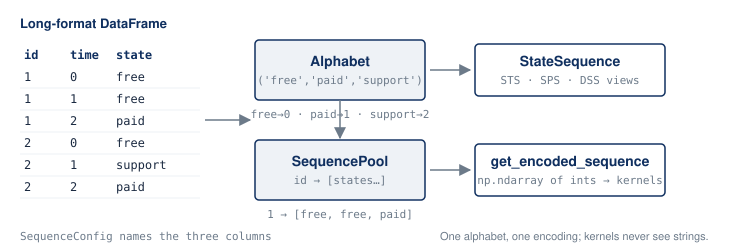

# The data model

Four value types carry the domain. Everything else in yasqat is a function
over them.



## Long format in, long format kept

yasqat's input is a **long-format** polars DataFrame: one row per (unit,
time step), with three columns naming the unit, the time, and the state.

```python
import polars as pl
from yasqat.core import SequencePool

df = pl.DataFrame(
    {
        "id":    [1, 1, 1, 2, 2, 2],
        "time":  [0, 1, 2, 0, 1, 2],
        "state": ["free", "free", "paid", "free", "support", "paid"],
    }
)
pool = SequencePool(df)
pool.describe()
```

```
{'n_sequences': 2, 'n_states': 3, 'states': ['free', 'paid', 'support'],
 'total_observations': 6, 'min_length': 3, 'max_length': 3,
 'mean_length': 3.0, 'median_length': 3.0}
```

The pool keeps the frame as-is (sorted by id and time) and never pivots it to
wide. Time steps can be integers or dates, and sequences can have different
lengths.

## `SequenceConfig`: which columns mean what

The defaults are `id`, `time`, and `state`. If your frame uses other names,
say so once; every function reads the config from the container.

```python
from yasqat.core import SequenceConfig

config = SequenceConfig(id_column="member_id", time_column="month", state_column="tier")
pool = SequencePool(df, config=config)
```

`granularity` is an optional label such as `"month"` that some statistics
(modal states, for example) use when reporting per-period results.

## `Alphabet`: the state vocabulary, encoded once

An `Alphabet` is the ordered tuple of states plus a colour map. It is inferred
from the data unless you pass one. Its job is the **encoding seam**: states
become integers in exactly one place, so the compiled distance kernels always
see the same representation.

```python
pool.alphabet.states
# ('free', 'paid', 'support')

pool.alphabet.encode(["free", "paid", "paid"])
# array([0, 1, 1])

pool.get_encoded_sequence(2)
# array([0, 2, 1])
```

Two consequences worth knowing. First, when you filter a pool, the filtered
pool keeps the **full** parent alphabet, so encodings stay comparable even if
a state no longer occurs. Second, the colour map (`pool.alphabet.colors`) is
there so that whatever you plot with, the same state gets the same colour
across figures. yasqat itself draws nothing.

## `SequencePool`: the analysis container

The pool is what every loader returns and what every metric, clustering, and
statistics function consumes. It pre-extracts each id's state list for fast
random access and owns the entry points:

| Method | Purpose |
|---|---|
| `compute_distances(method=..., n_jobs=...)` | pairwise distances into a `DistanceMatrix` |
| `filter(criteria, combine=...)` | a new pool holding only matching sequences |
| `filter_by_length`, `sample` | cheaper subsetting |
| `recode_states(mapping)` | collapse or rename states, returns a new pool |
| `to_state_sequence()` | the representation view (next section) |
| `describe()`, `sequence_lengths()` | quick summaries |

Pools are immutable in practice: every operation returns a new pool.

## `StateSequence`: the representation view

`StateSequence` wraps the same frame and provides the three standard sequence
representations plus per-sequence descriptives:

- **STS**, state per time point: what you loaded.
- **SPS**, state-permanence: one row per spell with `start`, `end`, and
  `duration`.
- **DSS**, distinct successive states: the sequence with repeats collapsed.

```python
ss = pool.to_state_sequence()
ss.to_sps().filter(pl.col("id") == 2)
```

```
┌─────┬──────────┬─────────┬───────┬─────┬──────────┐
│ id  ┆ spell_id ┆ state   ┆ start ┆ end ┆ duration │
╞═════╪══════════╪═════════╪═══════╪═════╪══════════╡
│ 2   ┆ 3        ┆ free    ┆ 0     ┆ 0   ┆ 1        │
│ 2   ┆ 4        ┆ support ┆ 1     ┆ 1   ┆ 1        │
│ 2   ┆ 5        ┆ paid    ┆ 2     ┆ 2   ┆ 1        │
└─────┴──────────┴─────────┴───────┴─────┴──────────┘
```

`StateSequence.from_intervals(df, time_points=...)` samples interval-shaped
input (start, end, state) onto a regular grid when your source system records
episodes rather than observations.

## Either container, one seam

Statistics and filters accept **either** a `StateSequence` or a
`SequencePool`. Internally each function normalises its argument through one
seam, `SequencePool.coerce`, so there is no type-checking scattered through
the codebase and no difference in results. The decision that made
`SequencePool` the canonical container is recorded in the repository as
ADR-0002; `StateSequence` remains the view for format conversions.
