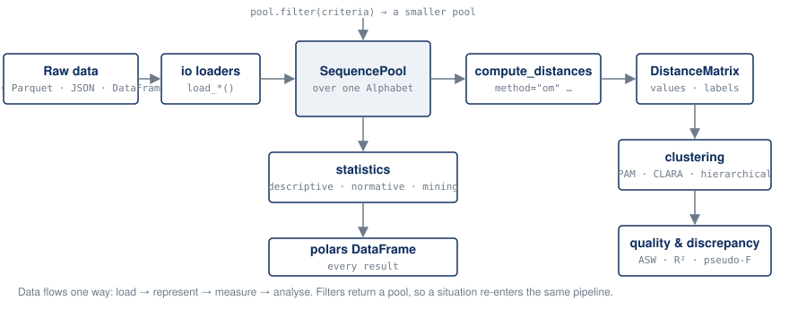

# The pipeline

Data flows one direction: **load → represent → measure → analyse**. Each
module owns one concept, and the seams between them are deliberately narrow.

## Modules

| Module | Responsibility | You call it for |
|---|---|---|
| `yasqat.io` | loaders and savers: CSV, Parquet, JSON, DataFrame | getting a `SequencePool` |
| `yasqat.core` | `Alphabet`, `SequenceConfig`, `SequencePool`, `StateSequence` | the data model, distances, filtering |
| `yasqat.metrics` | pairwise distance functions and `DistanceMatrix` | a single distance between two arrays; substitution matrices |
| `yasqat.clustering` | PAM, CLARA, hierarchical; quality indices; representatives | a typology |
| `yasqat.statistics` | transition rates, descriptive and normative indicators, mining, discrepancy | describing and testing |
| `yasqat.filters` | criteria: length, time, state, prefix, query | defining a situation |
| `yasqat.synthetic` | Markov and financial-journey generators | tests, demos, benchmarks |

## The four seams

Most of the library's surface is reached through four small interfaces. Knowing
them tells you where to look when something needs extending.

**One metric seam.** A metric is a free function
`name_distance(seq_a, seq_b, **kwargs) -> float` over integer-encoded arrays,
with the inner loop compiled by numba. Every metric is registered in one
dispatch dictionary inside `SequencePool.compute_distances`, which is the sole
path for pairwise and matrix computation. Adding a metric is adding a function
and a dictionary entry.

**One encoding seam.** States become integers only in
`SequencePool.get_encoded_sequence`, via the pool's `Alphabet`.

**One coercion seam.** Statistics and filters accept either container and
normalise it with `SequencePool.coerce`. Both containers expose the same
`data`, `config`, `alphabet`, and `sequence_ids` surface, described by the
`SequenceData` protocol.

**One per-sequence reduce seam.** Every indicator that maps a scalar over each
sequence, entropy, turbulence, spell count, and a dozen more, goes through a
shared reducer that owns the loop, the id column, and the choice between a
per-sequence DataFrame and an aggregate. Each statistic contributes only its
scalar function.

## Where filters re-enter

`pool.filter(criteria)` returns a pool, not a DataFrame, so a **situation**
(members who started on the free tier and contacted support, say) is just
another pool. It goes back into the same distances, clustering, and mining
calls. This is the shape behind the question "given this situation, what
tends to happen next": filter, then score. See
[Conditioning on a situation](../guides/filtering.md).

## What comes out

Every public function returns a polars `DataFrame`, or a small result object
(`DistanceMatrix`, a clustering result, a `DiscrepancyResult`) with a
`to_dataframe()` or plain attributes. There is no plotting layer: yasqat hands
you the numbers and stays out of the way of matplotlib, altair, or whatever
you already use. The alphabet's colour map is the one concession, so that
your figures stay consistent across states.
