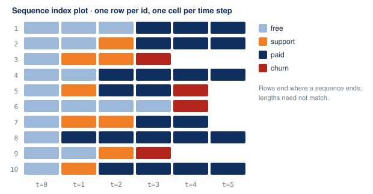

# What sequence analysis is

Categorical sequence analysis studies **ordered categorical states observed
over time**. It grew up in life-course sociology, where the sequences are
careers, family histories, and school-to-work transitions, but the data shape
is general: a subscription moving between plan tiers, an account moving between
activity levels, a patient moving between care settings.

## The objects

A **sequence** is one unit's ordered run of states. Ten subscription accounts,
observed monthly, look like this:

Each row is a sequence. Each cell is one time step, coloured by state. This
picture, called a sequence index plot, is the fastest way to see what the
methods below are measuring.

An **alphabet** is the finite vocabulary of states. Here it is
`{free, support, paid, churn}`. Every sequence in a population shares one
alphabet, and yasqat encodes it to integers exactly once (see the
[data model](data-model.md)).

A **spell** is a maximal run of one repeated state. Account 2 above has three
spells: `free` for two steps, `support` for one, `paid` for three. Spells
matter because many questions are about durations, not just orderings.

## The three questions

The discipline keeps returning to three questions, and yasqat's module layout
follows them.

**Similarity: how alike are two trajectories?** This needs a principled
distance between sequences of possibly different lengths. Optimal matching,
the edit distance of the field, counts the cheapest set of insertions,
deletions, and substitutions that turns one sequence into the other. yasqat
ships it, its variants, and a dozen alternatives (see
[Measuring distance](../guides/distances.md)).

**Typology: what kinds of trajectory exist?** Given a distance matrix, cluster
the sequences and read each cluster through its most central member, its
medoid. yasqat provides PAM, CLARA, and hierarchical clustering with the
quality indices to choose a number of clusters (see
[Clustering](../guides/clustering.md)).

**Dynamics: how do states flow?** Transition rates, time spent in each state,
how diverse or turbulent a path is, and whether a "bad" state tends to
persist. These read the pool directly, with no distance matrix (see
[Describing sequences](../guides/statistics.md)).

A fourth question has become common in applied work: **given a situation,
what tends to happen next, and how much more often than chance?** yasqat
answers it with frequent-subsequence mining and sequential association rules
scored by confidence and lift (see [Mining patterns](../guides/mining.md)),
and with pool-level filters that define the situation
([Conditioning on a situation](../guides/filtering.md)).

## Lineage

The reference implementation is TraMineR, an R package developed at the
University of Geneva since 2008. yasqat treats it as the oracle for algorithm
correctness, naming, and feature scope: the test suite pins expected values
against TraMineR's output rather than asserting loose bounds. TanaT, a Python
package, is a secondary reference for Python-specific adaptations. The aim is
fidelity to proven methods in a modern Python form, not novelty in the
algorithms.

## Vocabulary

The [glossary](../glossary.md) defines every term used here and in the API,
including the three standard sequence representations (STS, SPS, DSS) that
the `StateSequence` view converts between.
