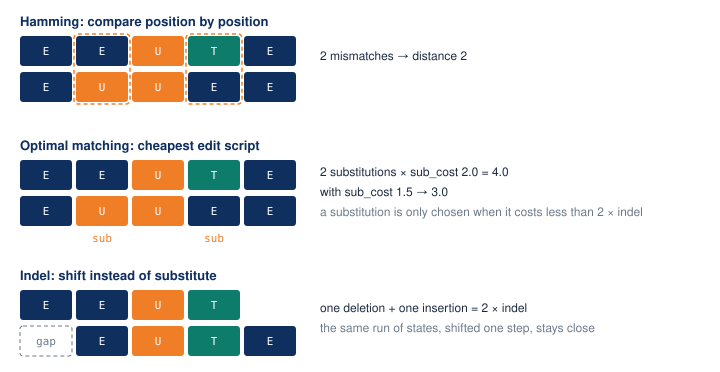

# Measuring distance

A distance between two sequences is the foundation of typology: cluster
quality can only be as good as the dissimilarity underneath it. This guide
works the main measure by hand, then surveys the alternatives and how to
choose.

## Optimal matching, by hand

Take two five-month histories from the labour-market alphabet, written with
initials:

```
a:  E E U T E      (employed, employed, unemployed, training, employed)
b:  E U U E E
```



**Hamming distance** compares position by position and counts mismatches.
Positions 2 and 4 differ, so the distance is 2. It only works for equal
lengths, and it treats a one-month shift of an identical career as maximally
different.

**Optimal matching (OM)** is the edit distance of the field: the cheapest way
to turn `a` into `b` using insertions and deletions (indels) and
substitutions. Each operation has a cost. With the defaults, an indel costs
1.0 and any substitution costs 2.0, so a substitution is never cheaper than
deleting one state and inserting another, and OM gives 4.0 for two
substitutions. Lower the substitution cost to 1.5 and the same alignment costs
3.0.

```python
from yasqat.metrics import hamming_distance, lcs_distance, optimal_matching_distance

alpha = pool.alphabet
a = alpha.encode(["employed", "employed", "unemployed", "training", "employed"])
b = alpha.encode(["employed", "unemployed", "unemployed", "employed", "employed"])

hamming_distance(a, b)                                     # 2.0
optimal_matching_distance(a, b, indel=1.0)                 # 4.0
optimal_matching_distance(a, b, indel=1.0, sub_cost=1.5)   # 3.0
lcs_distance(a, b)                                         # 4.0
```

The pairwise functions work on **integer-encoded arrays**, which is why the
example encodes through the pool's alphabet first. The pool method does this
for you.

The **indel** operation is what lets OM see that two careers are the same story
shifted by a month: delete one state at the start, insert one at the end, pay
two indels, and the runs line up. Hamming would charge for every position.

## A distance matrix for the whole pool

```python
dm = pool.compute_distances(method="om", indel=1.0)
dm.values.shape      # (300, 300)
dm.labels[:3]        # [0, 1, 2]
dm.values[:3, :3]
```

```
[[ 0. 20. 22.]
 [20.  0.  4.]
 [22.  4.  0.]]
```

`DistanceMatrix` holds the symmetric `values` array and the sequence ids as
`labels`. It converts to and from condensed form for scipy, and every
clustering function accepts it directly.

`compute_distances` is the one path for matrix computation. Two performance
notes:

- The loop is O(n²) pairs. Beyond a few thousand sequences, either
  `pool.sample(n)` first or use CLARA clustering, which samples internally.
- `n_jobs` runs pairs on a thread pool. The kernels release the GIL, so this
  pays off when the kernel dominates each pair, which means **long
  sequences**: hundreds of time points run about 3× faster with four threads.
  For a few dozen time points the per-pair Python overhead dominates and the
  sequential default is faster.

## Substitution costs

The substitution cost encodes how "far apart" two states are. Three common
choices:

**Constant** (the default): every substitution costs `sub_cost`, 2.0 unless
you say otherwise. Defensible when you have no theory of state distance.

**Transition-rate derived**: states that rarely follow each other are far
apart. This is TraMineR's `"TRATE"` method.

```python
from yasqat.statistics import substitution_cost_matrix

sm = substitution_cost_matrix(pool, method="trate")
```

```
[[0.    1.551 1.619]      rows and columns follow the alphabet order:
 [1.551 0.    1.747]      employed, training, unemployed
 [1.619 1.747 0.   ]]
```

Read it as: swapping `training` for `unemployed` (1.747) is a bigger edit than
swapping `employed` for `training` (1.551), because the data shows more direct
movement between the latter pair.

**Your own matrix**: any square array at least as large as the alphabet.

```python
dm = pool.compute_distances(method="om", sm=sm, indel=1.0)
```

The same module also builds indel-based, "future" (chi-squared), and
feature-based (Gower) matrices; see `substitution_cost_matrix` in the API
reference for the method names.

## The metric families

| Family | Methods | What it is sensitive to |
|---|---|---|
| Edit distances | `om`, `omloc`, `omspell`, `omstran`, `nms`, `nmsmst`, `svrspell`, `twed` | order and timing, with tunable costs; the spell and transition variants weight durations or state changes |
| Position-wise | `hamming`, `dhd` | what happens at the same time point; DHD lets the cost depend on the position |
| Common structure | `lcs`, `lcp`, `rlcp` | the longest common subsequence, prefix, or suffix; cheap and cost-free |
| Distribution-based | `euclidean`, `chi2` | how much time each sequence spends in each state, ignoring order |
| Warping | `dtw`, `softdtw` | shape, allowing local stretching of time |

Every method is a string accepted by `compute_distances(method=...)` and a
free function in `yasqat.metrics`; method-specific parameters pass through as
keyword arguments.

## How to choose

- **Timing matters, and careers can be shifted:** OM with a transition-rate
  matrix is the field default and a sound first choice.
- **Durations matter more than exact order** (how long someone stayed
  unemployed): `omspell`, or a distribution distance if order barely matters.
- **What happens at the same age or calendar month is the question:**
  Hamming, or DHD when early differences should weigh more than late ones.
- **You want something cost-free and fast to sanity-check a typology:** LCS.

Whatever you pick, compute two and compare the clusterings; a typology that
survives a change of metric is one you can defend.
